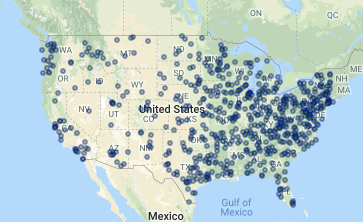

# Banking and Unemployment Real-Time_Map

The below script explores the relationship between states with high unemployment rates and bank counts per state.

In this script, we retrieved and plotted data from the 2013 US Census and Google Places API to show the relationship between various socioeconomic parameters and bank count across 700 randomly selected zip codes. Using Pandas, Numpy, Matplotlib, Requests, Census API, and Google API to accomplish this task.

