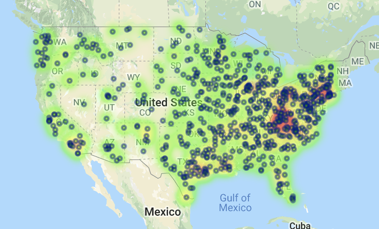

# Banking and Unemployment Real-Time_Map

# Background
The Census Bureau's mission is to serve as the nation’s leading provider of quality data about its people and economy. Then with Google APIs that is a set of application programming interfaces (APIs) developed by Google which allow communication with Google Services and their integration to other services. Examples of these include Search, Gmail, Translate or Google Maps.

# Goal
Explores the relationship between states with high unemployment rates and bank counts per state, from the 2013 US Census and Google Places API to show the relationship between various socioeconomic parameters and bank count across 700 randomly selected zip codes. Using Pandas, Numpy, Matplotlib, Requests, Census API, and Google API to accomplish this task.

# Findings

#

